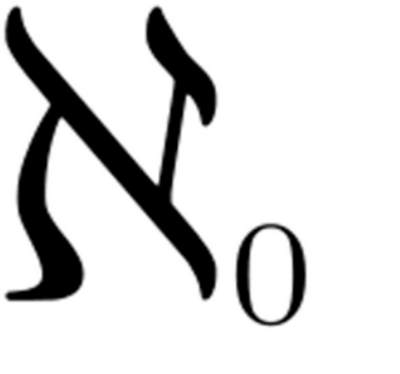

# Output Format Differences

## Beamer vs Article Output

This presentation demonstrates the differences between beamer (slide) and article (document) output formats:

- **Beamer Output**:
  - Content is split into slides
  - Columns appear side-by-side
  - Slide-specific formatting is preserved
  - Beamer-specific elements are visible

- **Article Output**:
  - Content flows continuously
  - Columns stack vertically
  - Beamer-specific elements are removed
  - More suitable for printed documents

::: beamer
This content will only appear in beamer output
:::

# General information


## Themes, fonts, etc.

- I use default **pandoc** themes.
- This presentation is made with **Frankfurt** theme and **beaver** color theme.
- I like **professionalfonts** font scheme. 

## Links

- Matrix of beamer themes: [https://hartwork.org/beamer-theme-matrix/](https://hartwork.org/beamer-theme-matrix/)
- Font themes: [http://www.deic.uab.es/~iblanes/beamer_gallery/index_by_font.html](http://www.deic.uab.es/~iblanes/beamer_gallery/index_by_font.html)
- Nerd Fonts: [https://nerdfonts.com](https://nerdfonts.com)

# Formatting
## Text formatting

Normal text.
*Italic text* and **bold text**.
~~Strike out~~ is supported.

## Notes

> This is a note.
> > Nested notes are not supported.
> And it continues.

## Blocks

### This is a block A

- Line A
- Line B

### 

New block without header.

### This is a block B.

- Line C
- Line D

## Listings

Listings out of the block.

```sh
#!/bin/bash
echo "Hello world!"
echo "line"
```
### Listings in the block.

```sh
#!/bin/bash
echo "Hello world!"
echo "line"
```

## Table

**Item** | **Description** | **Q-ty**
:--------|-----------------:|:---:
Item A | Item A description | 2
Item B | Item B description | 5
Item C | N/A | 100

## Single picture 

This is how we insert picture. Caption is produced automatically from the alt text.

```
 
```

 

## Two or more pictures in a raw

Here are two pictures in the raw. We can also change two pictures size (height or width).

###
```
{height=10%}\ {height=30%} 
```

{ height=10% }\ { height=30% }

## Lists

1. Idea 1
2. Idea 2
	- genius idea A
	- more genius 2
3. Conclusion


## Two columns of equal width

::: columns

:::: column

Left column text.

Another text line.

::::

:::: column

- Item 1.
- Item 2.
- Item 3.

::::

:::

## Two columns of with 40:60 split

::: columns

:::: {.column width=40%}

Left column text.

Another text line.

::::

:::: {.column width=60%}

- Item 1.
- Item 2.
- Item 3.

::::

:::

## Three columns with equal split

::: columns

:::: column

Left column text.

Another text line.

::::

:::: column

Middle column list:

1. Item 1.
2. Item 2.

::::

:::: column

Right column list:

- Item 1.
- Item 2.

::::

:::

## Three columns with 30:40:30 split

::: columns

:::: {.column width=30%}

Left column text.

Another text line.

::::

:::: {.column width=40%}

Middle column list:

1. Item 1.
2. Item 2.

::::

:::: {.column width=30%}

Right column list:

- Item 1.
- Item 2.

::::

:::

## Two columns: image and text

::: columns

:::: column

{height=50%}

::::

:::: column

Text in the right column.  

List from the right column:

- Item 1.
- Item 2.
::::

:::

## Two columns: image and table

::: columns

:::: column

{height=50%}

::::

:::: column

| **Item** | **Option** |
|:---------|:----------:|
| Item 1   | Option 1   |
| Item 2   | Option 2   |

::::

:::

## Fancy layout

### Proposal

- Point A
- Point B

::: columns

:::: column

### Pros

- Good
- Better
- Best

::::

:::: column

### Cons

- Bad
- Worse
- Worst

::::

:::

### Conclusion

- Let's go for it!
- No way we go for it!

## Article vs Beamer Differences

### Long Paragraph

This is a long paragraph that demonstrates how text flows differently in article mode versus beamer mode. In article mode, the text will flow naturally across the full page width, creating a more traditional document layout. In beamer mode, the text will be constrained to slide dimensions, often requiring manual line breaks or adjustments to fit within the slide boundaries.

### Mathematical Formulas

Here is an example of a mathematical formula:

$$
f(x) = \int_{-\infty}^\infty \hat f(\xi)\,e^{2 \pi i \xi x} \,d\xi
$$

In article mode, this formula will be centered on its own line with proper spacing. In beamer mode, it may need to be scaled down to fit within the slide.

### Block Quotes

> This is a block quote that will appear differently in article and beamer modes. In article mode, it will have proper indentation and spacing. In beamer mode, it may be styled according to the beamer theme.

### Footnotes

Here is some text with a footnote[^note].

[^note]: This is a footnote. In article mode, it will appear at the bottom of the page. In beamer mode, it may appear inline or at the bottom of the slide.
